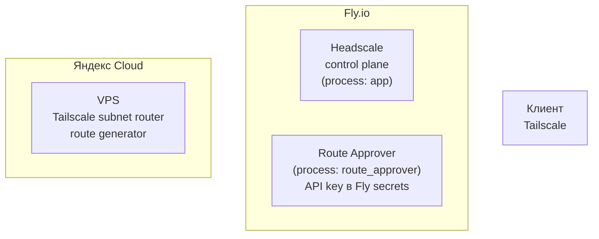
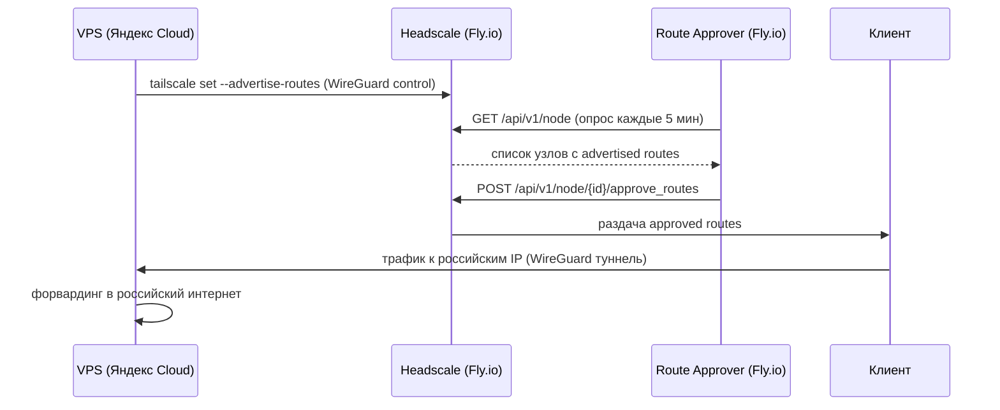

# Автоматическая маршрутизация российских сервисов через Tailscale и Headscale

## 1. Назначение

Цель решения — направлять трафик к выбранным российским сервисам через VPS, расположенный в России, при этом не отправлять весь интернет-трафик через VPN.

Схема предназначена для IP-based split tunneling:

```text
Российские сервисы → VPS в России
Остальной интернет → локальный провайдер пользователя
```

В рассматриваемой реализации:

- Headscale используется как control plane;
- Tailscale используется как VPN overlay;
- VPS в России размещён в Яндекс Cloud;
- маршруты генерируются автоматически на VPS;
- маршруты подтверждаются отдельным процессом в Fly.io через Headscale HTTP API;
- API-ключ Headscale хранится в Fly secrets, а не на российском VPS.

---

## 2. Базовые понятия

### Tailscale

Tailscale — VPN-система поверх WireGuard. Она создаёт защищённую mesh-сеть между устройствами.

Устройства получают внутренние Tailscale-адреса и могут обмениваться трафиком напрямую или через relay, если прямое соединение невозможно.

### Headscale

Headscale — открытая реализация control plane для Tailscale.

Он отвечает за:

- регистрацию узлов;
- управление ключами;
- распространение маршрутов;
- ACL;
- подтверждение subnet routes.

Пользовательский трафик через Headscale не проходит.

### Subnet Router

Subnet Router — узел Tailscale, который объявляет маршруты к внешним IP-подсетям.

Например:

```text
77.88.0.0/18
5.255.192.0/18
```

Если клиент принимает маршруты, он начинает отправлять трафик к этим подсетям через соответствующий Tailscale-узел.

### Exit Node

Exit Node направляет через выбранный узел весь интернет-трафик.

В данном решении Exit Node не используется, потому что нужен не полный VPN-шлюз, а выборочная маршрутизация только к российским сервисам.

---

## 3. Архитектура

**Развёртывание**



**Потоки данных**



---

## 4. Распределение ответственности

### Российский VPS

Делает только следующее:

1. Разрешает DNS-имена российских сервисов.
2. Определяет ASN через Team Cymru.
3. Добавляет статические ASN.
4. Исключает запрещённые ASN.
5. Генерирует CIDR-префиксы через bgpq4.
6. Агрегирует маршруты.
7. Публикует маршруты через:

```bash
tailscale set --advertise-routes=...
```

На VPS не хранится API-ключ Headscale.

### Headscale

Выполняет роль control plane:

- регистрирует узлы;
- хранит состояние сети;
- принимает advertised routes;
- распространяет approved routes клиентам.

### Route Approver process

Отдельный процесс в том же Fly.io app:

- хранит API-ключ через Fly secrets;
- обращается к Headscale HTTP API;
- находит gateway-узлы;
- подтверждает опубликованные маршруты.

---

## 5. Конфигурационные файлы на VPS

- [`vps/config/asns.txt`](../vps/config/asns.txt) — статический список ASN, которые всегда включаются. Не добавлять крупные операторские ASN без крайней необходимости.
- [`vps/config/asn-denylist.txt`](../vps/config/asn-denylist.txt) — ASN, которые запрещено добавлять даже если они найдены через DNS. Эти ASN дают слишком много маршрутов и размывают split tunneling.
- [`vps/config/hosts.txt`](../vps/config/hosts.txt) — DNS-имена сервисов, по которым нужно обнаруживать дополнительные ASN.

Конфиги устанавливаются в `/etc/tailscale-ru-routes/` на VPS.

---

## 6. Скрипт генерации маршрутов на VPS

[`vps/scripts/update-tailscale-ru-routes.sh`](../vps/scripts/update-tailscale-ru-routes.sh)

Устанавливается в `/usr/local/sbin/update-tailscale-ru-routes.sh`.

```bash
sudo chmod +x /usr/local/sbin/update-tailscale-ru-routes.sh
```

---

## 7. Cron на VPS

Рекомендуемый интервал — каждые 3 часа.

```cron
17 */3 * * * /usr/local/sbin/update-tailscale-ru-routes.sh >> /var/log/tailscale-ru-routes.log 2>&1
```

Установить:

```bash
sudo crontab -e
```

Проверить:

```bash
sudo crontab -l
tail -f /var/log/tailscale-ru-routes.log
```

---

## 8. Скрипты подтверждения маршрутов (Headscale / Fly.io)

- [`headscale/scripts/approve-gateway-routes.sh`](../headscale/scripts/approve-gateway-routes.sh) — подтверждает маршруты через Headscale HTTP API. Использует только curl и jq, без Headscale CLI. Устанавливается в `/usr/local/bin/approve-gateway-routes.sh`.
- [`headscale/scripts/cron-approve-routes.sh`](../headscale/scripts/cron-approve-routes.sh) — loop-обёртка для Fly process group `route_approver`. Устанавливается в `/usr/local/bin/cron-approve-routes.sh`.

Если в конкретной версии Headscale JSON-поле с опубликованными маршрутами называется иначе, нужно посмотреть:

```bash
curl -s -H "Authorization: Bearer $HEADSCALE_API_KEY" \
  "$HEADSCALE_URL/api/v1/node" | jq .
```

и добавить нужное поле в выражение в скрипте:

```jq
.availableRoutes // .subnetRoutes // .routes // []
```

---

## 9. Dockerfile

[`headscale/Dockerfile`](../headscale/Dockerfile) — добавления к Alpine-based образу Headscale.

---

## 10. fly.toml

[`headscale/fly.toml`](../headscale/fly.toml) — конфигурация Fly.io app с двумя process groups.

Важно:

- `http_service.processes = ["app"]` обязателен, потому что только Headscale-процесс слушает HTTP-порт.
- `route_approver` не должен иметь публичного HTTP service.
- `GATEWAY_NODE_NAME_REGEX = ".*"` одобрит маршруты всех узлов, если теги не работают. Лучше заменить на конкретный шаблон, например `"^ru-gateway"`.

---

## 11. Fly secrets

API-ключ не хранится в `fly.toml`.

На сервере Headscale создать ключ:

```bash
headscale apikeys create --expiration 90d
```

Установить secret:

```bash
fly secrets set HEADSCALE_API_KEY="PASTE_API_KEY_HERE" \
  --app your-headscale-app
```

---

## 12. Масштабирование Fly process groups

Запустить один Headscale-процесс и один approver-процесс:

```bash
fly scale count app=1 route_approver=1 --app your-headscale-app
```

Проверить логи:

```bash
fly logs --app your-headscale-app
```

---

## 13. Настройка российского VPS

Установить зависимости:

```bash
sudo apt update
sudo apt install -y tailscale bgpq4 dnsutils python3
```

Включить IP forwarding:

```bash
sudo sysctl -w net.ipv4.ip_forward=1
```

Сохранить постоянно:

```bash
echo 'net.ipv4.ip_forward = 1' \
| sudo tee /etc/sysctl.d/99-ip-forward.conf

sudo sysctl --system
```

Подключить VPS к Headscale:

```bash
sudo tailscale up \
  --login-server https://your-headscale-domain.example.com \
  --hostname ru-gateway
```

Если теги работают в вашей версии Headscale и policy это разрешает:

```bash
sudo tailscale up \
  --login-server https://your-headscale-domain.example.com \
  --hostname ru-gateway \
  --advertise-tags=tag:gateway
```

---

## 14. Проверка

### На VPS

```bash
sudo /usr/local/sbin/update-tailscale-ru-routes.sh
```

Проверить количество маршрутов:

```bash
wc -l /var/lib/tailscale-ru-routes/routes.txt
cat /var/lib/tailscale-ru-routes/effective-asns.txt
```

Проверить распределение по маскам:

```bash
cut -d/ -f2 /var/lib/tailscale-ru-routes/routes.txt | sort -n | uniq -c
```

### В Fly logs

```bash
fly logs --app your-headscale-app
```

Ожидаемые сообщения:

```text
Route approver started
Processing node ...
Approving ... routes for node ...
Approved ... routes for node ...
```

### На клиенте

Клиент должен принимать маршруты:

```bash
tailscale up --accept-routes
```

Проверить маршрут до российского сервиса:

```bash
traceroute gosuslugi.ru
```

Проверить нероссийский трафик:

```bash
traceroute google.com
```

Ожидаемо:

```text
gosuslugi.ru → через российский VPS
google.com   → напрямую
```

---

## 15. Ограничения и рекомендации

### Не включать крупные операторские ASN

Не добавлять без необходимости ASN крупных операторов (Rostelecom, MTS, MegaFon, Beeline) — они резко увеличивают число маршрутов.

### Использовать denylist

Даже если крупный ASN найден через DNS, он должен быть исключён через [`vps/config/asn-denylist.txt`](../vps/config/asn-denylist.txt).

### Ограничить максимальное число маршрутов

В скрипте задано `MAX_ROUTES=500`. Если маршрутов больше, скрипт не применяет изменения. Это защита от случайного добавления слишком широкого ASN.

### Не хранить Headscale API key на VPS

API-ключ должен храниться только в Fly secrets. VPS должен уметь только публиковать маршруты через Tailscale.

---

## 16. Итог

Финальная схема:

```text
VPS в Яндекс Cloud:
  DNS → ASN → bgpq4 → routes.txt → tailscale set --advertise-routes

Headscale на Fly.io:
  control plane

Route approver process на Fly.io:
  curl + jq → Headscale API → approve advertised routes

Клиенты:
  tailscale up --accept-routes
```

Результат:

- российские сервисы идут через VPS в России;
- остальной интернет идёт напрямую;
- API-ключ Headscale не хранится на VPS;
- маршруты обновляются автоматически;
- подтверждение маршрутов выполняется через API.
